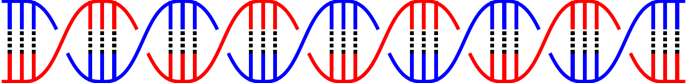
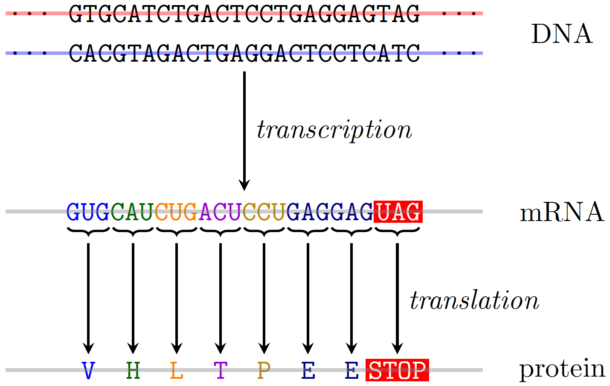

# Biology

## DNA

> Combining the `braids` package with a custom macro to produce a neat visualisation of the DNA molecule.

**Preview**

## Gene Expression

> A visualisation of the gene expression process (transcription + translation). In retrospect, this involved a lot of manual positioning, and if I were to remake this I'd probably wrap the triplets in their own nodes.

**Preview**

