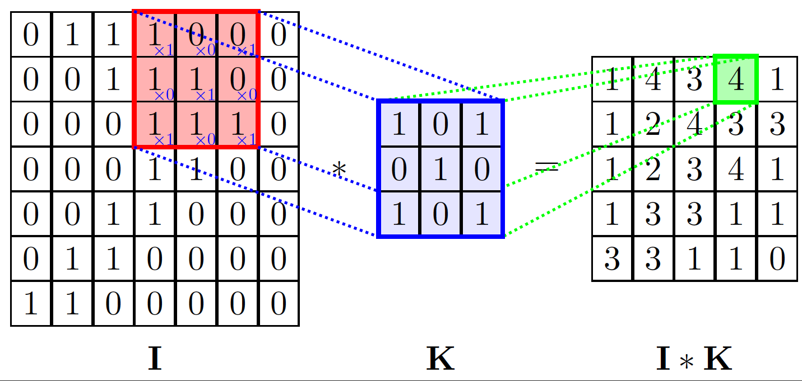
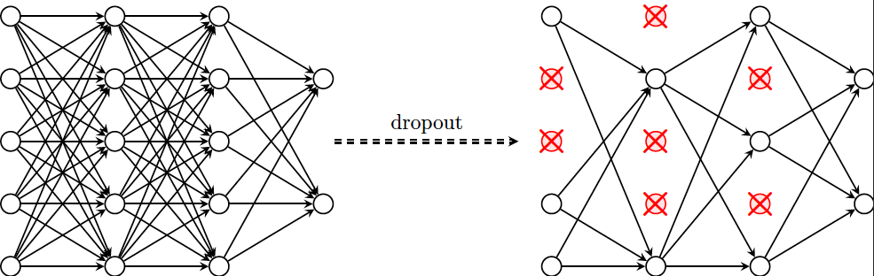
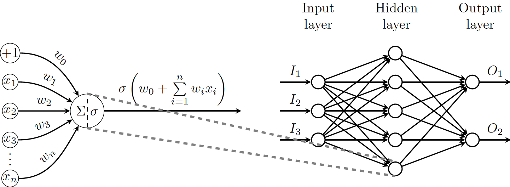

# Neural Networks

## 2D Convolution

> A diagram expressing a two-dimensional convolutional operator as an operation of sliding the kernel matrix across the target image and recording elementwise products. Makes heavy use of the `matrix` environment in TikZ.

**Preview**

## Dropout

> A diagram demonstrating the effects of applying dropout with p = 0.5 to a deep multilayer perceptron. In retrospect, this could have been done much cleaner with for loops.

**Preview**

## Multilayer Perceptron (MLP)

> A diagram representing an in-depth view at a single perceptron, along with its position within a larger-scale multilayer perceptron (~unrestricted feed-forward neural network).

**Preview**

